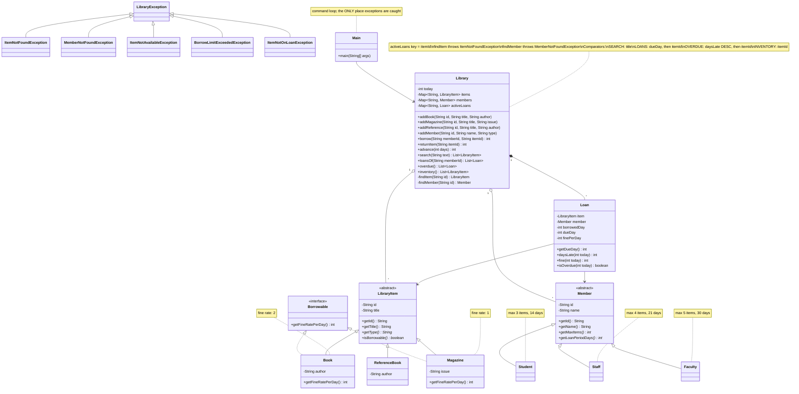

```mermaid
classDiagram
    class Borrowable {
        <<interface>>
        +getFineRatePerDay() int
    }
    class LibraryItem {
        <<abstract>>
        -String id
        -String title
        +getId() String
        +getTitle() String
        +getType()* String
        +isBorrowable()* boolean
    }
    class Book {
        -String author
        +getFineRatePerDay() int
    }
    class Magazine {
        -String issue
        +getFineRatePerDay() int
    }
    class ReferenceBook {
        -String author
    }
    LibraryItem <|-- Book
    LibraryItem <|-- Magazine
    LibraryItem <|-- ReferenceBook
    Borrowable <|.. Book
    Borrowable <|.. Magazine
    note for Book "fine rate: 2"
    note for Magazine "fine rate: 1"

    class Member {
        <<abstract>>
        -String id
        -String name
        +getId() String
        +getName() String
        +getMaxItems()* int
        +getLoanPeriodDays()* int
    }
    class Student
    class Staff
    class Faculty
    Member <|-- Student
    Member <|-- Staff
    Member <|-- Faculty
    note for Student "max 3 items, 14 days"
    note for Staff "max 4 items, 21 days"
    note for Faculty "max 5 items, 30 days"

    class Loan {
        -LibraryItem item
        -Member member
        -int borrowedDay
        -int dueDay
        -int finePerDay
        +getDueDay() int
        +daysLate(int today) int
        +fine(int today) int
        +isOverdue(int today) boolean
    }
    Loan --> LibraryItem
    Loan --> Member

    class Library {
        -int today
        -Map~String, LibraryItem~ items
        -Map~String, Member~ members
        -Map~String, Loan~ activeLoans
        +addBook(String id, String title, String author)
        +addMagazine(String id, String title, String issue)
        +addReference(String id, String title, String author)
        +addMember(String id, String name, String type)
        +borrow(String memberId, String itemId) int
        +returnItem(String itemId) int
        +advance(int days) int
        +search(String text) List~LibraryItem~
        +loansOf(String memberId) List~Loan~
        +overdue() List~Loan~
        +inventory() List~LibraryItem~
        -findItem(String id) LibraryItem
        -findMember(String id) Member
    }
    Library "1" o-- "*" LibraryItem
    Library "1" o-- "*" Member
    Library "1" *-- "*" Loan
    note for Library "activeLoans key = itemId\nfindItem throws ItemNotFoundException\nfindMember throws MemberNotFoundException\nComparators:\nSEARCH: title\nLOANS: dueDay, then itemId\nOVERDUE: daysLate DESC, then itemId\nINVENTORY: itemId"

    class LibraryException
    LibraryException <|-- ItemNotFoundException
    LibraryException <|-- MemberNotFoundException
    LibraryException <|-- ItemNotAvailableException
    LibraryException <|-- BorrowLimitExceededException
    LibraryException <|-- ItemNotOnLoanException

    class Main {
        +main(String[] args)
    }
    Main --> Library
    note for Main "command loop; the ONLY place exceptions are caught"
```