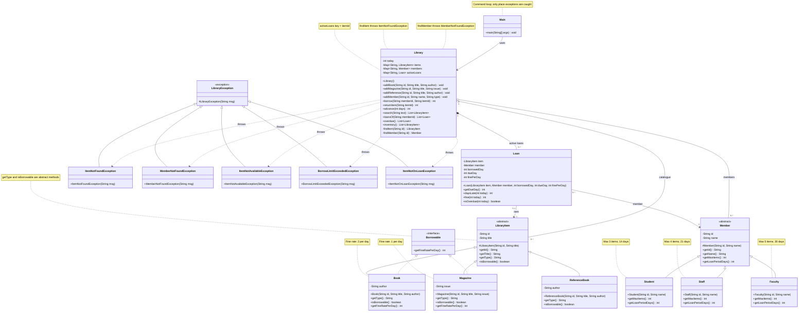

```mermaid
classDiagram
    direction TB

    class LibraryItem {
        <<abstract>>
        -String id
        -String title
        #LibraryItem(String id, String title)
        +getId() String
        +getTitle() String
        +getType() String
        +isBorrowable() boolean
    }

    class Borrowable {
        <<interface>>
        +getFineRatePerDay() int
    }

    class Book {
        -String author
        +Book(String id, String title, String author)
        +getType() String
        +isBorrowable() boolean
        +getFineRatePerDay() int
    }

    class Magazine {
        -String issue
        +Magazine(String id, String title, String issue)
        +getType() String
        +isBorrowable() boolean
        +getFineRatePerDay() int
    }

    class ReferenceBook {
        -String author
        +ReferenceBook(String id, String title, String author)
        +getType() String
        +isBorrowable() boolean
    }

    LibraryItem <|-- Book
    LibraryItem <|-- Magazine
    LibraryItem <|-- ReferenceBook
    Borrowable <|.. Book
    Borrowable <|.. Magazine

    note for LibraryItem "getType and isBorrowable are abstract methods"
    note for Book "Fine rate: 2 per day"
    note for Magazine "Fine rate: 1 per day"

    class Member {
        <<abstract>>
        -String id
        -String name
        #Member(String id, String name)
        +getId() String
        +getName() String
        +getMaxItems() int
        +getLoanPeriodDays() int
    }

    class Student {
        +Student(String id, String name)
        +getMaxItems() int
        +getLoanPeriodDays() int
    }

    class Staff {
        +Staff(String id, String name)
        +getMaxItems() int
        +getLoanPeriodDays() int
    }

    class Faculty {
        +Faculty(String id, String name)
        +getMaxItems() int
        +getLoanPeriodDays() int
    }

    Member <|-- Student
    Member <|-- Staff
    Member <|-- Faculty

    note for Student "Max 3 items; 14 days"
    note for Staff "Max 4 items; 21 days"
    note for Faculty "Max 5 items; 30 days"

    class Loan {
        -LibraryItem item
        -Member member
        -int borrowedDay
        -int dueDay
        -int finePerDay
        +Loan(LibraryItem item, Member member, int borrowedDay, int dueDay, int finePerDay)
        +getDueDay() int
        +daysLate(int today) int
        +fine(int today) int
        +isOverdue(int today) boolean
    }

    Loan "0..1" --> "1" LibraryItem : item
    Loan "0..*" --> "1" Member : member

    class Library {
        -int today
        -Map~String, LibraryItem~ items
        -Map~String, Member~ members
        -Map~String, Loan~ activeLoans
        +Library()
        +addBook(String id, String title, String author) void
        +addMagazine(String id, String title, String issue) void
        +addReference(String id, String title, String author) void
        +addMember(String id, String name, String type) void
        +borrow(String memberId, String itemId) int
        +returnItem(String itemId) int
        +advance(int days) int
        +search(String text) List~LibraryItem~
        +loansOf(String memberId) List~Loan~
        +overdue() List~Loan~
        +inventory() List~LibraryItem~
        -findItem(String id) LibraryItem
        -findMember(String id) Member
    }

    Library "1" o-- "0..*" LibraryItem : catalogue
    Library "1" *-- "0..*" Loan : active loans
    Library "1" o-- "0..*" Member : members

    note for Library "activeLoans key = itemId"
    note for Library "findItem throws ItemNotFoundException"
    note for Library "findMember throws MemberNotFoundException"

    class Main {
        +main(String[] args) void
    }

    Main --> Library : uses
    note for Main "Command loop; only place exceptions are caught"

    class LibraryException {
        <<exception>>
        #LibraryException(String msg)
    }

    class ItemNotFoundException {
        +ItemNotFoundException(String msg)
    }

    class MemberNotFoundException {
        +MemberNotFoundException(String msg)
    }

    class ItemNotAvailableException {
        +ItemNotAvailableException(String msg)
    }

    class BorrowLimitExceededException {
        +BorrowLimitExceededException(String msg)
    }

    class ItemNotOnLoanException {
        +ItemNotOnLoanException(String msg)
    }

    LibraryException <|-- ItemNotFoundException
    LibraryException <|-- MemberNotFoundException
    LibraryException <|-- ItemNotAvailableException
    LibraryException <|-- BorrowLimitExceededException
    LibraryException <|-- ItemNotOnLoanException

    Library ..> ItemNotFoundException : throws
    Library ..> MemberNotFoundException : throws
    Library ..> ItemNotAvailableException : throws
    Library ..> BorrowLimitExceededException : throws
    Library ..> ItemNotOnLoanException : throws
```
